# 前端工程化

> 喂喂喂，那个切图的，把页面写好就发给研发工程师套模板吧。

你好，切图仔。

不知道你的团队如何定义前端开发，据我所知，时至今日仍然有很多团队会把前端开发归类为产品或者设计岗位，虽然身份之争多少有些无谓，但我对这种偏见还是心存芥蒂，酝酿了许久，决定写一个系列的文章，试着从工程的角度系统的介绍一下我对前端，尤其是Web前端的理解。

只要我们还把自己的工作看作为一项软件开发活动，那么我相信读过下面的内容你也一定会有所共鸣。

## 前端，是一种GUI软件

现如今前端可谓包罗万象，产品形态五花八门，涉猎极广，什么高大上的基础库/框架，拽炫酷的宣传页面，还有屌炸天的小游戏……不过这些一两个文件的小项目并非是前端技术的主要应用场景，更具商业价值的则是复杂的Web应用，它们功能完善，界面繁多，为用户提供了完整的产品体验，可能是新闻聚合网站，可能是在线购物平台，可能是社交网络，可能是金融信贷应用，可能是音乐互动社区，也可能是视频上传与分享平台……

> 从本质上讲，所有Web应用都是一种运行在网页浏览器中的软件，这些软件的图形用户界面（Graphical User Interface，简称GUI）即为前端。

如此复杂的Web应用，动辄几十上百人共同开发维护，其前端界面通常也颇具规模，工程量不亚于一般的传统GUI软件：


尽管Web应用的复杂程度与日俱增，用户对其前端界面也提出了更高的要求，但时至今日仍然没有多少前端开发者会从软件工程的角度去思考前端开发，来助力团队的开发效率，更有甚者还对前端保留着”如玩具般简单“的刻板印象，日复一日，刀耕火种。

历史悠久的前端开发，始终像是放养的野孩子，原始如斯，不免让人慨叹！

## 前端工程的三个阶段

现在的前端开发倒也并非一无所有，回顾一下曾经经历过或听闻过的项目，为了提升其前端开发效率和运行性能，前端团队的工程建设大致会经历三个阶段：

### 第一阶段：库/框架选型


前端工程建设的第一项任务就是根据项目特征进行技术选型。

基本上现在没有人完全从0开始做网站，哪怕是政府项目用个jquery都很正常吧，React/Angularjs等框架横空出世，解放了不少生产力，合理的技术选型可以为项目节省许多工程量这点毋庸置疑。

### 第二阶段：简单构建优化


选型之后基本上就可以开始敲码了，不过光解决开发效率还不够，必须要兼顾运行性能。前端工程进行到第二阶段会选型一种构建工具，对代码进行压缩，校验，之后再以页面为单位进行简单的资源合并。

前端开发工程化程度之低，常常出乎我的意料，我之前在百度工作时是没有多少概念的，直到离开大公司的温室，去到业界与更多的团队交流才发现，能做到这个阶段在业界来说已然超出平均水平，属于“具备较高工程化程度”的团队了，查看网上形形色色的网页源代码，能做到最基本的JS/CSS压缩的Web应用都已跨入标准互联网公司行列，不难理解为什么很多前端团队对于前端工程构建的认知还仅停留在“压缩、校验、合并”这种程度。

### 第三阶段：JS/CSS模块化开发


分而治之是软件工程中的重要思想，是复杂系统开发和维护的基石，这点放在前端开发中同样适用。在解决了基本开发效率运行效率问题之后，前端团队开始思考维护效率，模块化是目前前端最流行的分治手段。

> 很多人觉得模块化开发的工程意义是复用，我不太认可这种看法，在我看来，模块化开发的最大价值应该是分治，是分治，分治！（重说三）。
> 
> 不管你将来是否要复用某段代码，你都有充分的理由将其分治为一个模块。

JS模块化方案很多，AMD/CommonJS/UMD/ES6 Module等，对应的框架和工具也一大堆，说起来很烦，大家自行百度吧；CSS模块化开发基本都是在less、sass、stylus等预处理器的import/mixin特性支持下实现的。

虽然这些技术由来已久，在如今这个“言必及React”的时代略显落伍，但想想业界的绝大多数团队的工程化落后程度，放眼望去，毫不夸张的说，能达到第三阶段的前端团队已属于高端行列，基本具备了开发维护一般规模Web应用的能力。

然而，做到这些就够了么？Naive！

## 第四阶段

> 前端是一种技术问题较少、工程问题较多的软件开发领域。

当我们要开发一款完整的Web应用时，前端将面临更多的工程问题，比如：

* 大体量：多功能、多页面、多状态、多系统；
* 大规模：多人甚至多团队合作开发；
* 高性能：CDN部署、[缓存控制](https://developers.google.com/speed/docs/insights/LeverageBrowserCaching)、[文件指纹](https://developers.google.com/speed/docs/insights/LeverageBrowserCaching)、缓存复用、请求合并、按需加载、同步/异步加载、移动端[首屏CSS内嵌](https://developers.google.com/speed/docs/insights/mobile)、HTTP 2.0服务端[资源推送](http://chimera.labs.oreilly.com/books/1230000000545/ch12.html#HTTP2_PUSH)。

> 扩展阅读：[大公司里怎样开发和部署前端代码？](https://github.com/fouber/blog/issues/6)

这些无疑是一系列严肃的系统工程问题。

前面讲的三个阶段虽然相比曾经“茹毛饮血”的时代进步不少，但用于支撑第四阶段的多人合作开发以及精细的性能优化似乎还欠缺点什么。

到底，缺什么呢？

## 没有银弹

读过《[人月神话](http://book.douban.com/subject/2230248/)》的人应该都听说过，软件工程 [没有银弹](http://baike.baidu.com/view/277972.htm)。没错，前端开发同样没有银弹，可是现在是连™铅弹都没有的年月！（刚有了BB弹，摔）

前端历来以“简单”著称，在前端开发者群体中，小而美的价值观占据着主要的话语权，甚至成为了某种信仰，想与其他人交流一下工程方面的心得，得到的回应往往都是两个字：太重。

> 重你妹！你的脑容量只有4K吗？

工程方案其实也可以小而美！只不过它的小而美不是指代码量，而是指“规则”。找到问题的根源，用最少最简单明了的规则制定出最容易遵守最容易理解的开发规范或工具，以提升开发效率和工程质量，这同样是小而美的典范！

2011年我有幸参与到 [FIS](http://fis.baidu.com) 项目中，与百度众多大中型项目的前端研发团队共同合作，不断探索实践前端开发的工程化解决方案，13年离开百度去往UC，面对完全不同的产品形态，不同的业务场景，不同的适配终端，甚至不同的网络环境，过往的方法论仍然能够快速落地，为多个团队的不同业务场景量身定制出合理的前端解决方案。

这些经历让我明悟了一个道理：

> 进入第四阶段，我们只需做好两件事就能大幅提升前端开发效率，并且兼顾运行性能，那就是——组件化开发与资源管理。

### 第一件事：组件化开发

分治的确是非常重要的工程优化手段。在我看来，前端作为一种GUI软件，光有JS/CSS的模块化还不够，对于UI组件的分治也有着同样迫切的需求：


如上图，这是我所信仰的前端组件化开发理念，简单解读一下：

1. 页面上的每个 **独立的** 可视/可交互区域视为一个组件；
2. **每个组件对应一个工程目录**，组件所需的各种资源都在这个目录下**就近维护**；
3. 由于组件具有独立性，因此组件与组件之间可以 **自由组合**；
4. 页面只不过是组件的容器，负责组合组件形成功能完整的界面；
4. 当不需要某个组件，或者想要替换组件时，可以整个目录删除/替换。

其中第二项描述的就近维护原则，是我觉得最具工程价值的地方，它为前端开发提供了很好的分治策略，每个开发者都将清楚的知道，自己所开发维护的功能单元，其代码必然存在于对应的组件目录中，在那个目录下能找到有关这个功能单元的所有内部逻辑，样式也好，JS也好，页面结构也好，都在那里。

组件化开发具有较高的通用性，无论是前端渲染的单页面应用，还是后端模板渲染的多页面应用，组件化开发的概念都能适用。组件HTML部分根据业务选型的不同，可以是静态的HTML文件，可以是前端模板，也可以是后端模板：


> 不同的技术选型决定了不同的组件封装和调用策略。

基于这样的工程理念，我们很容易将系统以独立的组件为单元进行分工划分：


由于系统功能被分治到独立的模块或组件中，粒度比较精细，组织形式松散，开发者之间不会产生开发时序的依赖，大幅提升并行的开发效率，理论上允许随时加入新成员认领组件开发或维护工作，也更容易支持多个团队共同维护一个大型站点的开发。

结合前面提到的模块化开发，整个前端项目可以划分为这么几种开发概念：

| 名称 | 说明 | 举例 |
|-----|-----|-----|
| JS模块 |独立的算法和数据单元|浏览器环境检测(detect)，网络请求(ajax)，应用配置(config)，DOM操作(dom)，工具函数(utils)，以及组件里的JS单元|
| CSS模块 |独立的功能性样式单元|栅格系统(grid)，字体图标(icon-fonts)，动画样式(animate)，以及组件里的CSS单元|
| UI组件 |独立的可视/可交互功能单元|页头(header)，页尾(footer)，导航栏(nav)，搜索框(search)|
| 页面 |前端这种GUI软件的界面状态，是UI组件的容器|首页(index)，列表页(list)，用户管理(user)|
| 应用 |整个项目或整个站点被称之为应用，由多个页面组成| |

以上5种开发概念以相对较少的规则组成了前端开发的基本工程结构，基于这些理念，我眼中的前端开发就成了这个样子：

|示意图|描述|
|----|----|
||整个Web应用由页面组成|
|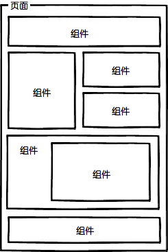|页面由组件组成|
||一个组件一个目录，资源就近维护|
||组件可组合，<br/>组件的JS可依赖其他JS模块，<br/>CSS可依赖其他CSS单元|

综合上面的描述，对于一般中小规模的项目，大致可以规划出这样的源码目录结构：

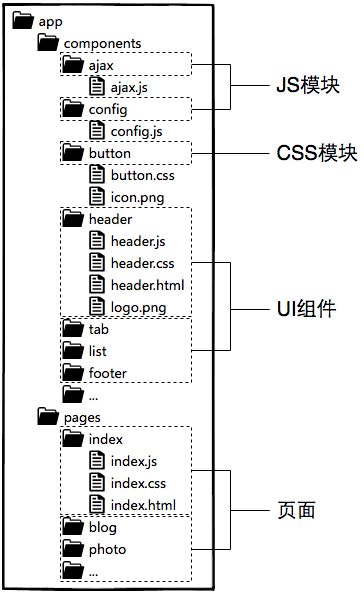

如果项目规模较大，涉及多个团队协作，还可以将具有相关业务功能的页面组织在一起，形成一个子系统，进一步将整个站点拆分出多个子系统来分配给不同团队维护，针对这种情况后面我会单开文章详细介绍。

以上架构设计历经许多不同公司不同业务场景的前端团队验证，收获了不错的口碑，是行之有效的前端工程分治方案。

> 吐槽：我本人非常反对某些前端团队将前端开发划分为“JS开发”和“页面重构”两种岗位，更倾向于组件粒度的开发理念，对GUI软件开发的分工规划应该以功能为单位，而不是开发语言；对开发者的技术要求也应该是掌握完整的端内技术。

### 第二件事：“智能”静态资源管理

上面提到的模块化/组件化开发，仅仅描述了一种开发理念，也可以认为是一种开发规范，倘若你认可这规范，对它的分治策略产生了共鸣，那我们就可以继续聊聊它的具体实现了。

很明显，模块化/组件化开发之后，我们最终要解决的，就是模块/组件加载的技术问题。然而前端与客户端GUI软件有一个很大的不同：

> 前端是一种远程部署，运行时增量下载的GUI软件

前端应用没有安装过程，其所需程序资源都部署在远程服务器，用户使用浏览器访问不同的页面来加载不同的资源，随着页面访问的增加，渐进式的将整个程序下载到本地运行，“增量下载”是前端在工程上有别于客户端GUI软件的根本原因。


上图展示了一款界面繁多功能丰富的应用，如果采用Web实现，相信也是不小的体量，如果用户第一次访问页面就强制其加载全站静态资源再展示，相信会有很多用户因为失去耐心而流失。根据“增量”的原则，我们应该精心规划每个页面的资源加载策略，使得用户无论访问哪个页面都能按需加载页面所需资源，没访问过的无需加载，访问过的可以缓存复用，最终带来流畅的应用体验。

这正是Web应用“免安装”的魅力所在。

由“增量”原则引申出的前端优化技巧几乎成为了性能优化的核心，有加载相关的按需加载、延迟加载、预加载、请求合并等策略；有缓存相关的浏览器缓存利用，缓存更新、缓存共享、非覆盖式发布等方案；还有复杂的BigRender、BigPipe、Quickling、PageCache等技术。这些优化方案无不围绕着如何将增量原则做到极致而展开。

所以我觉得：

> 第四阶段前端开发最迫切需要做好的就是在基础架构中贯彻增量原则。

相信这种贯彻不会随着时间的推移而改变，在可预见的未来，无论在HTTP1.x还是HTTP2.0时代，无论在ES5亦或者ES6/7时代，无论是AMD/CommonJS/UMD亦或者ES6 module时代，无论端内技术如何变迁，我们都有足够充分的理由要做好前端程序资源的增量加载。

正如前面说到的，第三阶段前端工程缺少点什么呢？我觉得是在其基础架构中缺少这样一种“智能”的资源加载方案。没有这样的方案，很难将前端应用的规模发展到第四阶段，很难实现落地前面介绍的那种组件化开发方案，也很难让多方合作高效率的完成一项大型应用的开发，并保证其最终运行性能良好。在第四阶段，我们需要强大的工程化手段来管理”玩具般简单“的前端开发。

在我的印象中，Facebook是这方面探索的伟大先驱之一，早在2010年的[Velocity China大会](http://velocity.oreilly.com.cn/2010/)上，来自Facebook的[David Wei博士](http://davidwei.org/)就为业界展示了他们令人惊艳的[静态网页资源管理和优化](http://velocity.oreilly.com.cn/2010/index.php?func=session&name=%E9%9D%99%E6%80%81%E7%BD%91%E9%A1%B5%E8%B5%84%E6%BA%90%E7%9A%84%E7%AE%A1%E7%90%86%E5%92%8C%E4%BC%98%E5%8C%96)技术。

David Wei博士在当年的交流会上提到过一些关于Facebook的一些产品数据：

> * Facebook整站有10000+个静态资源；
> * 每个静态资源都有可能被翻译成超过100种语言版本；
> * 每种资源又会针对浏览器生成3种不同的版本；
> * 要针对不同带宽的用户做5种不同的打包方法；
> * 有3、4个不同的用户组，用于小批次体验新的产品功能；
> * 还要考虑不同的送达方法，可以直接送达，或者通过iframe的方式提升资源并行加载的速度；
> * 静态资源的压缩和非压缩状态可切换，用于调试和定位线上问题

这是一个状态爆炸的问题，将所有状态乘起来，整个网站的资源组合方式会达到几百万种之多（去重之后统计大概有300万种组合方式）。支撑这么大规模前端项目运行的底层架构正是魏博士在那次演讲中分享的[Static Resource Management System](http://velocity.oreilly.com.cn/2010/ppts/VelocityChina2010Dec7StaticResource.pdf)(静态资源管理系统)，用以解决Facebook项目中有关前端工程的3D问题（Development，Deployment，Debugging）。


那段时间 [FIS](http://fis.baidu.com) 项目正好遇到瓶颈，当时的FIS还是一个用php写的task-based构建工具，那时候对于前端工程的认知度很低，觉得前端构建不就是几个压缩优化校验打包任务的组合吗，写好流程调度，就针对不同需求写插件呗，看似非常简单。但当我们支撑越来越多的业务团队，接触到各种不同的业务场景时，我们深刻的感受到task-based工具的粗糙，团队每天疲于根据各种业务场景编写各种打包插件，构建逻辑异常复杂，隐隐看到不可控的迹象。

我们很快意识到把基础架构放到构建工具中实现是一件很愚蠢的事，试图依靠构建工具实现各种优化策略使得构建变成了一个巨大的黑盒，一旦发生问题，定位起来非常困难，而且每种业务场景都有不同的优化需求，构建工具只能通过静态分析来优化加载，具有很大的局限性，单页面/多页面/PC端/移动端/前端渲染/后端渲染/多语言/多皮肤/高级优化等等资源加载问题，总不能给每个都写一套工具吧，更何况这些问题彼此之间还可以有多种组合应用，工具根本写不过来。

Facebook的做法无疑为我们亮起了一盏明灯，不过可惜它并不开源（不是技术封锁，而是这个系统依赖FB体系中的其他方面，通用性不强，开源意义不大），我们只能尝试挖掘相关信息，网上对它的完整介绍还是非常非常少，分析facebook的前端代码也没有太多收获，后来无意中发现了facebook使用的项目管理工具[phabricator](http://phabricator.org/)中的一个静态管理方案[Celerity](https://secure.phabricator.com/book/phabdev/article/celerity/)，以及相关的[说明](https://secure.phabricator.com/book/phabflavor/article/soon_static_resources/)，看它的描述很像是Facebook静态资源管理系统的一个mini版！

简单看过整个系统之后发现原理并不复杂（小而美的典范），它是通过一个小工具扫描所有静态资源，生成一张资源表，然后有一个PHP实现的资源管理框架（Celerity）提供了资源加载接口，替代了传统的script/link等静态的资源加载标签，最终通过查表来加载资源。

虽然没有真正看过FB的那套系统，但眼前的这个小小的框架给了当时的我们足够多的启示：

> 静态资源管理系统 = 资源表 + 资源加载框架

多么优雅的实现啊！

资源表是一份数据文件（比如JSON），是项目中所有静态资源（主要是JS和CSS）的构建信息记录，通过构建工具扫描项目源码生成，是一种k-v结构的数据，以每个资源的id为key，记录了资源的类别、部署路径、依赖关系、打包合并等内容，比如：

```json
{
    "a.js": {
        "url": "/static/js/a.5f100fa.js",
        "dep": [ "b.js", "a.css" ]
    },
    "a.css": {
        "url": "/static/css/a.63cf374.css",
        "dep": [ "button.css" ]
    },
    "b.js": {
        "url": "/static/js/b.97193bf.js"
    },
    "button.css": {
        "url": "/static/css/button.de33108.css"
    }
}
```

而资源加载框架则提供一些资源引用的API，让开发者根据id来引用资源，替代静态的script/link标签来收集、去重、按需加载资源。调用这些接口时，框架通过查表来查找资源的各项信息，并递归查找其依赖的资源的信息，然后我们可以在这个过程中实现各种性能优化算法来“智能”加载资源。

根据业务场景的不同，加载框架可以在浏览器中用JS实现，也可以是后端模板引擎中用服务端语言实现，甚至二者的组合，不一而足。


> 有关加载框架的具体实现我曾写过很多文章介绍，可以扩展阅读：
>
> * [前端工程与性能优化](https://github.com/fouber/blog/issues/3)
> * [前端工程与模块化框架](https://github.com/fouber/blog/issues/4)

这种设计很快被验证具有足够的灵活性，能够完美支撑不同团队不同技术规范下的性能优化需求，前面提到的按需加载、延迟加载、预加载、请求合并、文件指纹、CDN部署、Bigpipe、Quickling、BigRender、首屏CSS内嵌、HTTP 2.0服务端推送等等性能优化手段都可以很容易的在这种架构上实现，甚至可以根据性能日志自动进行优化（Facebook已实现）。

因为有了资源表，我们可以很方便的控制资源加载，通过各种手段在运行时计算页面的资源使用情况，从而获得最佳加载性能。无论是前端渲染的单页面应用，还是后端渲染的多页面应用，这种方法都同样适用。

此外，它还很巧妙的约束了构建工具的职责——只生成资源表。资源表是非常通用的数据结构，无论什么业务场景，其业务代码最终都可以被扫描为相同结构的表数据，并标记资源间的依赖关系，有了表之后我们只需根据不同的业务场景定制不同的资源加载框架就行了，从此彻底告别一个团队维护一套工具的时代！！！


> 恩，如你所见，虽然彻底告别了一个团队一套工具的时代，但似乎又进入了一个团队一套框架的时代。其实还是有差别的，因为框架具有很大的灵活性，而且不那么黑盒，采用框架实现资源管理相比构建更容易调试、定位和升级变更。

深耕静态资源加载框架可以带来许多收益，而且有足够的灵活性和健壮性面向未来的技术变革，这个我们留作后话。

## 总结

回顾一下前面提到过的前端工程三个阶段：

* 第一阶段：库/框架选型
* 第二阶段：简单构建优化
* 第三阶段：JS/CSS模块化开发

现在补充上第四阶段：

* 第四阶段：组件化开发与资源管理

由于先天缺陷，**前端相比其他软件开发，在基础架构上更加迫切的需要组件化开发和资源管理**，而解决资源管理的方法其实一点也不复杂：

> 一个通用的资源表生成工具 + 基于表的资源加载框架

近几年来各种你听到过的各种资源加载优化策略大部分都可以在这样一套基础上实现，而这种优化对于业务来说是完全透明的，不需要重构的性能优化——这不正是我们一直所期盼的吗？正如魏小亮博士所说：我们可以把优秀的人集中起来去优化加载。

如何选型技术、如何定制规范、如何分治系统、如何优化性能、如何加载资源，当你从切图开始转变为思考这些问题的时候，我想说：

你好，工程师！

--------


> 前端工程其实是一个很大的话题，开发仅是其中的一部分。

原文地址：https://github.com/fouber/blog/issues/10#issuecomment-135318404

# Node.js

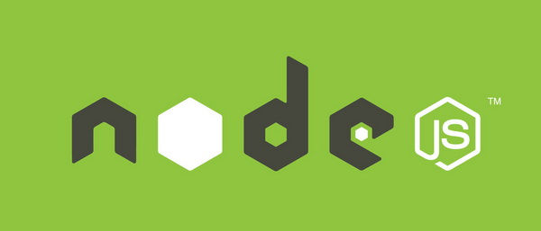

[Node.js](https://nodejs.org/en/) 是一个基于 [Chrome V8](https://developers.google.com/v8/) 引擎的 JavaScript 运行环境。Node.js 使用了一个事件驱动、非阻塞式 I/O 的模型，使其轻量又高效。Node.js 的包管理器 [npm](https://www.npmjs.com/)，是全球最大的开源库生态系统

## 介绍

JavaScript 高涨的人气带来了很多变化，以至于如今使用其进行网络开发的形式也变得截然不同了。就如同在浏览器中一样，现在我们也可以在服务器上运行 JavaScript ，从前端跨越到后端，这样巨大的反差让人难以想象，因为仅仅在几年前 Javascript 还如同 Flash 或者 Java applet 那样嵌入网页在沙箱环境中运行。

在深入Node.js之前，你可能需要阅读和了解使用跨栈式JavaScript（JavaScript across the stack）带来的好处，它统一了编程语言和数据格式（JSON），让你能最佳地重用开发人员资源。由于这更多的是关于 JavaScript 的特点，这里就不过多讨论它。但它确实是一个让人在开发环节中使用 Node 的关键的优点。

正如维基百科 所说：“Node.js 是谷歌 V8 引擎、libuv平台抽象层 以及主体使用 Javscript 编写的核心库三者集合的一个包装外壳。” 除此之外，值得注意的是，Node.js 的作者瑞恩·达尔 (Ryan Dahl) 的目标是创建具有实时推送能力的网站。在 Node.js 中，他给了开发者一个使用事件驱动来实现异步开发的优秀解决方案。（注：V8是谷歌开发的，目前公认最快的 Javascript 解析引擎，libuv 是一个开源的、为 Node 定制而生的跨平台的异步 IO 库。）

简而言之：Node.js 在实时的 Web应用上采用了基于 WebSocket 的推送技术。这意味着什么样的革命性？Well，在经过了20多年的基于无状态的请求-返机制的无状态交互之后，我们终于有了实时的，双向连接的web应用，客户端和服务器端都可以发起通信，能够自由地交换数据。与此形成鲜明对比的是传统的 web响应模式，客户端总是主动发起通信而服务端被动返回。此外，这些都是基于运行在标准80端口上的开放Web组件（HTML、CSS和JS）。

可能有人会说，我们已经使用 Flash 和 Java Applet 的形式很多年了——但实际上，这些方式只是使用网络将数据传递到客户端上的沙箱环境。他们都是隔离运行的，而且经常操作到需要额外的权限之类的非标准端口。

凭借其独特的优势，Node.js的现在已经在许多著名公司的产品中起到了关键作用。

在这篇文章中，我们不仅将讨论这些优势是如何实现的，而且也会讨论为什么你使用 Node.js 来替代一些经典的Web应用程序模型。

## Node.js 是如何工作的？

Node.js 的主要思路是：使用非阻塞的，事件驱动的 I/O 操作来保持在处理跨平台 (across distributed devices) 数据密集型实时应用时的轻巧高效。这听起来有点绕口。

它的真正含义是，Node.js 不是一个即将主导Web开发的世界的银弹级的平台。相反，它是一个满足特别需求的平台。你肯定不会希望使用 Node.js 去做 CPU密集型操作。事实上，使用它进行繁重的计算等于摒弃 Node 几乎所有的优点。Node 真正的亮点在于建设高性能，高扩展性的互联网应用——因为它能够处理庞大的并且高吞吐量的并发连接。

它的工作原理是相当有趣的。传统的网络服务技术，是每个新增一个连接（请求）便生成一个新的线程，这个新的线程会占用系统内存，最终会占掉所有的可用内存。而 Node.js 仅仅只运行在一个单线程中，使用非阻塞的异步 I/O 调用，所有连接都由该线程处理，在 libuv 的加分下，可以允许其支持数万并发连接（全部挂在该线程的事件循环中）。

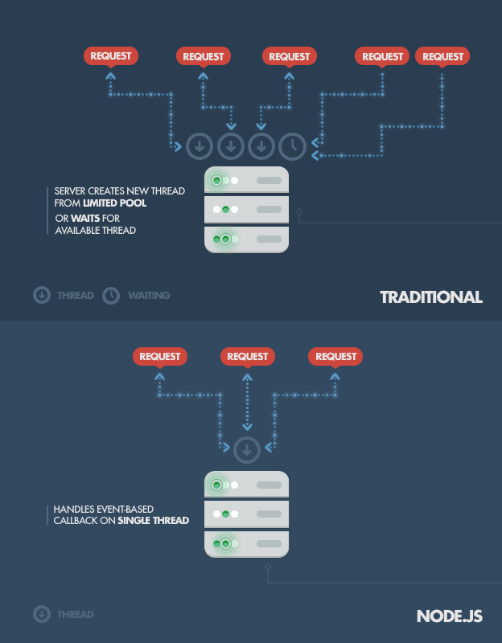

做一个简单的计算: 假设是普通的Web程序，新接入一个连接会占用 2M 的内存，在有 8GB RAM的系统上运行时, 算上线程之间上下文切换的成本，并发连接的最大理论值则为 4000 个。这是在传统 Web服务端技术下的处理情况。而 Node.js 则达到了约 1M 一个并发连接的拓展级别 (相关证明).

当然，在所有客户端的请求共享单一线程时也会有问题, 这也是一个编写 Node.js 应用的潜在缺陷. 首先, 大量的计算可能会使得 Node 的单线程暂时失去反应, 并导致所有的其他客户端的请求一直阻塞, 直到计算结束才恢复正常。 其次，开发人员需要非常小心，不要让一个 Exception 阻塞核心的事件循环，因为这将导致 Node.js 实例的终止（实际上就是程序崩溃）。（ 笔者注：如 PHP 中某个页面挂掉是不会影响网站运行的，但是 Nodejs 是一个线程一个线程来处理所有的链接，所以不论是计算卡了或者是被异常阻塞了都可能会影响到其他所有的链接。解决方案在稍后讨论。）

用来避免异常抛出时中断进程的方法是将异常使用回调传递出去（而不是抛出他们，就像在其他环境中一样）。即使一些未处理的异常阻塞了程序，依旧有多种应对的解决方案，而且也有很多可用于监视 Node 进程来执行必要的崩溃后恢复工作的策略和工具（虽然你将无法恢复用户的 Session ），最常见的是使用 Forever 模块，或者采用其他的外部系统工具如 upstart and monit。

## NPM: The Node Package Manager

当我们讨论 Node.js 的时候，一个绝对不应该忽略地方就是默认内置的模块管理工具 —— NPM。 其灵感来源与 Ruby Gems（具有版本和依赖管理功能，可以通过在线资料库便捷安装可重用的组件的管理工具）。

一个完整的公用模块列表可以在 NPM 的网站上找到（https:://npmjs.org/），或者通过使用与 Node.js 一同安装的 NPM CLI 工具放问到。该模块的生态系统向所有人开放，任何人都可以发布自己的模块，所有的模块都可以在 NPM 资料库中找到。你可以在 http://howtonode.org/introduction-to-npm 页面找到 NPM 的一个简要介绍（有点旧，但依旧能看）。

目前非常流行的一些 NPM 模块有：

- express – Express.js,是一个简洁而灵活的 node.js Web应用框架, 并且已经是现在大多数 Node.js 应用的标准框架，你已经可以在很多 Node.js 的书籍中看到它了。
- connect – Connect 是一个 Node.js 的 HTTP 服务拓展框架，提供一个高性能的“插件”集合，以中间件闻名，是 Express 的基础部分之一。
- socket.io 和 sockjs – 目前服务端最流行的两个 websocket 组件。
- Jade – 流行的模板引擎之一，并且是 Express.js 的默认模板引擎。其灵感来源于 HAML。
- mongo 和 mongojs – 封装了 MongoDB 的的各种 API，不过笔者平常工作用的是 mongoose 也很推荐。
- redis – Redis 的客户端函数库.
- coffee-script – CoffeeScript 编译器，允许开发者使用 Coffee 来编写他们的 Node.js 程序。
- underscore (lodash, lazy) – 最流行的 JavaScript 工具库 , 用于 Node.js 的封装包，以及两个采取略有不同的实现方法来获得更好性能的同行。
- forever – 可能是用来确保 node 脚本持续运行的最流行的工具。

## Node.js 应该用在什么地方

**聊天**

聊天是最典型的多用户实时交互的应用。从 IRC 开始，有许多开源或者不开源的协议都运行在非标准端口上，而现在，使用 Node.js 则可以解决这些问题——在标准的80端口运行 WebSockets。

聊天应用程序是最能体现 Node.js 优点的例子：轻量级、高流量并且能良好的应对跨平台设备上运行密集型数据（虽然计算能力低）。同时，聊天也是一个非常值得学习的用例，因为它很简单，并且涵盖了目前为止一个典型的 Node.js 会用到的大部分解决方案。

让我们试着来描绘它如何工作。

在最简单的情况下，我们布置了一个聊天室在我们的网站上，用户可以在上面发消息，当然是一对多的形式。例如，假设总共有三个人连接到我们的网站上。

在服务端这边， 我们有一个使用 Express.js 搭建的简单站点，该站点实现了两件事 1) 处理路径为 ‘/’ 的GET请求时，下发包括一个留言板以及一个发送信息的 ‘发送’ 按钮的页面 2) 一个监听客户端发送新消息的 websockets 服务。

在客户端这边，我们有一个 HTML 页面，上面有个两个 js 方法，一个是用于触发事件的 “发送” 按钮，这会把把输入的消息通过 webscoket 发送，另一个方法是用 webscoket 在客户端上监听服务端来的推送（例如，其他用户发送的消息）。

当有一个客户端发送消息的时候，发生的事情是：

- 浏览器上，点击发送按钮触发了 js 函数，将输入框中的文字通过 websocket 消息发送到服务器的 websocket 客户端（页面初始化加载的时候连接的）。
- 服务端的 websocket 组件收到 消息，然后通过广播方法转发到其他所有连接的客户端。
-  通过页面上运行的 websocket 客户端组件，所有的客户端都能收到这条推送的新消息。接着 js 处理函数可以把这个消息添加到文字框内。

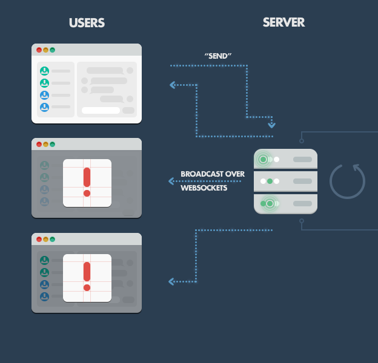

这是一个最简单的例子。如果要更好的解决方案，你可以使用 Redis 数据库做一个简单的缓存。在一个更高级的解决方案中，你可能需要一个消息路由来专门处理消息队列，并且需要一个更强健的发送机制，比如发送的时候覆盖上暂时离线的用户或者为离线的注册用户存储尚未接收的消息等等。但是不论你做了怎么样的改进，Node.js 都将遵循一个基本原则：响应事件，处理多个并发连接，并保持流动性的用户体验。

**对象数据库接口（API ON TOP OF AN OBJECT DB）**

尽管，Node.js 确实非常擅长实时交互的应用，同时它也十分适合通过对象数据库（object DB）来查询数据（如 MongoDB）。以 JSON 格式存储的数据允许 Node.js 直接处理，不需要纠结数据转换和匹配的问题。

举个例子，如果你正在使用 Rails，你会将 JSON 数据转成 二进制的 model，当数据再被 Backbone.js, Angular.js 或者 jQuery AJAX 之类的调用又要转回 JSON。如果是 Nodejs 的话，你可以通过一个 REST API 简单的导出 JSON 对象以供客户端使用。另外，从数据库读写时候如果使用的是 MongoDB 的话，你也不用担心的 JSON 与任何数据之间的格式问题。总之，你可以避免多元的数据转换问题，不论是在客户端、服务端还是数据库。

**队列输入**

如果你正在接收一个高量并发的数据，你的数据库可能会成为你处理的瓶颈。正如上面的描述，Node.js 可以轻松的处理并发连接。 但是，由于数据库操作是一个阻塞的操作（在这种情况下），这就是麻烦的地方。Node.js的解决方案是，在数据真正的写入之前就承认客户端的数据是真实的。

用这种方法，在高负载的时候系统继续维持它的响应，这在当客户端不需要严格确认一个数据是否成功的被写入时特别有用。典型的例子包括：日志记录或者用户跟踪数据（user-tracking data）的记录，这会被分批处理并且在稍后才使用；同时也包括最终一致性（so, 常用于 NoSQL）可以接受，不需要立即反应的操作（例如 Facebook 上更新点赞的数目）。

数据通过某些缓存或者消息队列的基础组件（例如 RabbitMQ, ZeroMQ）进入队列，并且通过一个独立的数据库批量写入进程来一一消化，或者通过一个更高性能的计算密集型后端服务来进行处理。其他的语言/框架也可以实现相似的操作，但在相同的配置下是达不到 nodejs 的高吞吐量与高并发。

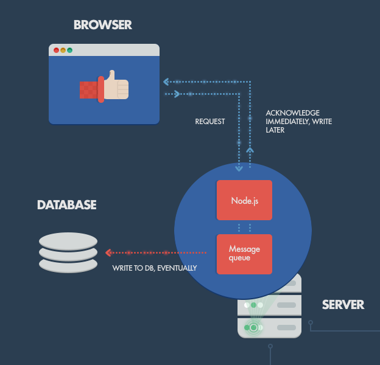

简单的说：使用 Node，你可以把数据库操作扔到一边并在稍后处理它们，假设他们成功了一样继续执行下去。（笔者注：在开发中通常的情况通常是，种耗时的操作通过回调函数来异步处理，主线程继续往下执行）

**数据流**

在较为传统的网络平台上，HTTP 的请求和响应更像是孤立的事件；然而事实上，他们都是数据流。这一观察结果在 Nodejs 上可以用来建立一些很酷的功能。因为数据通以流的形式接收，而我们可以在网站上在线处理正在上传中的文件。这样的话，就可以实现实时的音频和视频编码，以及在不同数据源之间进行代码（代理见下一段）。

>（笔者注：Node 有代替如 apache 这样的 webserver 处理数据，所以开发者可以直接收到客户端一份一份上传的数据，并实时处理。上面这段话听起来有点抽象，不过各位可以简单的想象一下不需要开 YY 或者 QQ，打开网页就能进行语音视频的功能。）

**代理**

Node.js 可以通过异步的方式处理大量的并发连接，所以很容易作为服务端的代理来使用。这在与不同响应时间的不同服务之间进行代理，或者是收集来自多个来源的数据时尤其有用。

举个例子：考虑一个服务器端的应用程序和第三方资源进行通信以更新自不同来源的数据，或者将服务端上的一些图像和视频资源存储到第三方云服务。

虽然专用代理服务器确实存在，但是如果你还没有专用的代理服务器，或者你需要一个本地开发的解决方案，那么使用 Node 来做代理可能是更好的选择。关于这个解决方案，我的意思是指当你在开发的时候，你可以使用Node.js的开发环境搭建一个服务来处理对资源和代理的请求，而在生产环境下，你可以使用专用的代理服务（比如nginx，HAProxy等）来处理这些交互。


## 什么地方可以使用 Node.js

**服务端 WEB 应用**

通过 Node.js 使用 Express.js 也可以用来创建服务端上的典型的网页应用。然而，虽然有可能，使用 Node.js 来进行请求+响应的形式来呈现 HTML 并不是最典型的用例。有人赞成也有人反对这一做法。这里有一些看法以供参考:

优点：

- 如果你不需要进行 CPU密集型计算，你可以从头到尾甚至是数据库（比如 MongoDB）都使用 Javascript 来开发。这显著地减轻了开发工序（包括成本）。
- 对于一个使用 Node.js 作为服务端的单页应用或者 websocket 应用，爬虫可以收到一个完全 HTML 呈现的响应，这是更为SEO友好的。

缺点：

- 任何CPU密集型的计算都将阻碍 Node.js 的反应，所以使用多线程的平台是一个更好的方法。或者，您也可以尝试向外扩展的计算[*]。
- Node.js 使用关系型数据库依旧十分痛苦（详细见下方）。拜托了，如果你想执行关系型数据操作，请考虑别的环境：Rails， Django 甚至 ASP.NET MVC 。。。。
>【*】另一种解决方案是，为这些CPU密集型的计算建立一个高度可扩展的MQ支持的环境与后端处理，以保持 Node 作为一个前台专员来异步处理客户端请求。


## Node.js 不应该在什么地方使用

**使用关系型数据库的服务端 WEB 应用**

对比 Node.js 上的 Express.js 和 Ruby on Rails，当你使用关系型数据库的时候请毫不犹豫的选择后者。

Node.js 的关系数据库工具仍处于早期阶段，目前还没有成熟到让人能够愉快地使用它。而与此同时，Rails天生自带了数据访问组件，连同DB schema迁移的支持工具和一些Gems（一语双关，一指这些如同珍宝的工具，二指ruby的gems程序包）。Rails和它的搭档框架们拥有非常成熟且被证明了的活动记录（Active Record）或数据映射（Data Mapper）的数据访问层的实现，而这些是当你在使用纯JavaScript来复制这些应用的时候会非常想要使用的东西。

不过，如果你真的倾向于全部使用 JS（并且做好可能抓狂的准备），那么请继续关注 Sequelize 和 Node ORM2 ，虽然这两者仍然不成熟的，但他们最终会迎头赶上。

>[*] 使用 Node 光是作为前端而 Rails 做后端来连接关系型数据库，这是完全有可能也并不少见的。（笔者注：国外有种说法，PHP这一类程序员也可以算作是前端）

**繁重的服务端的计算和处理**

当涉及到大量的计算，Node.js 就不是最佳的解决方案。你肯定不希望使用 Node.js 建立一个斐波那契数的计算服务。一般情况下，任何 CPU密集型操作 会削弱掉 Node通过事件驱动， 异步 I/O 模型等等带来的在吞吐量上的优势，因为当线程被非异步的高计算量占用时任何传入的请求将被阻塞。

正如前面所说，Node.js 是单线程的，只使用一个单一的CPU核心。至于，涉及到服务器上多核并发处理，Node 的核心团队已经使用 cluster 模块的形式在这一方面做了一些工作 (参考：http://nodejs.org/api/cluster.html)。当然，您也可以很容易的通过 nginx 的反向代理运行多个 Node.js 的服务器实例来避免单一线程阻塞的问题。

关于集群(clustering) ，你应该将所有繁重的计算转移到更合适的语言写的后台进程来处理，同时让他们通过像 RabbitMQ 那样通过消息队列服务器来进行通信。

即使你的后台处理可能最初运行在同一台服务器上时看不出什么优点，但是这样的做法具有非常高的可扩展性的潜力。这些后台处理服务可以容易地分割出去，作为单独的 worker 服务器，而不需要配置入口 web服务器的负载。

当然，你也可以在其他语言平台上用同样的方法，但使用 Node.js 你可以得到很高的吞吐量，每个请求都作为一个小任务非常迅速和高效地处理，这一点我们已经讨论过了。
## 总结

我们已经从理论到实践讨论过 Node.js 了，从它的目标和野心，到其优点和缺点。在 Node.js 的开发中99%的问题是由误用阻塞操作而造成的。

请记住：Node.js 从来不是用于解决大规模计算问题而创建的。它的出现是为了解决大规模I/O 的问题，并且在这一点上做的非常好。

综上，如果你项目需求中不包含CPU密集型操作，也不需要访问任何阻塞的资源，那么你就可以利用的 Node.js 的优点，尽情的享受快速、可扩展的网络应用。

原文地址：http://blog.jobbole.com/53736/


# AngularJS


AngularJS是web应用的下一个巨头。

AngularJS如果为创建web应用而设计，那它就是HTML的套路了。具有数据绑定, MVW, MVVM, MVC, 依赖注入的声明式模板和出色的可测试性都是用纯客户端 JavaScript来实现的! AngularJS 是一个创建富客户端应用的JavaScript MVC框架，它组织良好，经过严格测试,多功能，强大并且十分灵活。你仍然需要具有服务端后台，但大多数的用户交互逻辑将优雅地放到客户端上处理。

AngularJS是一个开源的web应用框架，由Google和社区进行维护，它可以创建单页的应用程序，一个页面的应用仅仅需要HTML,CSS和JavaScript在客户端。它的目标是增强页面的模型-视图-控制（MVC）的功能，为简化开发和测试。
它是一个建立在厚客户端的清爽的新模块web应用程序。一个健壮的框架建立在商业应用网络上。它鼓励最佳实践，开发模型和开发高质量的可维护的模块化应用程序。它的团队是世界一流的，社区是极其出色的，它结合最棒的功能来创建web应用。

AngularJS允许你编写客户端的web应用程序，如果你有一个智能浏览器。它允许你使用好用的旧式的HTML作为你的模板语言，允许你扩展HTML语法来清晰、简洁的表达你的应用组件。它通过双向数据绑定使你的UI（视图层）与你的JavaScript对象（模型层）的数据自动同步。帮助你更好的构建你的应用和更方便的测试，AngularJs告诉浏览器如何依赖注入和控制反转。它帮助改良了允许异步回调和延迟、使客户端导航和深层链接使用哈希bang格式地址和HTML5 pushStat与服务端通信更容易。

Angular 提供了：

- 结构模型的引入（MVC,SPA等）
- 增强HTML支持新特性。
- 避免直接DOM操作来避免很难调试不可追踪的代码。
- 包含低耦合和高可复用性
- 应用程序内部规则测试
- 视图模板更接近服务器端模板

AngularJS 是基于声明式编程模式 是用户可以基于业务逻辑进行开发. 该框架基于HTML的内容填充并做了双向数据绑定从而完成了自动数据同步机制. 最后, AngularJS 强化的DOM操作增强了可测试性.

设计初衷:

- 将ＤＯＭ操作从应用中解耦. 增强了可测试性。
- 应用测试性与开发代码同样重要. 测试的复杂程度与代码的设计结构强相关.
- 客户端与服务端解耦. 实现了并发处理机制增强了代码复用性.
- 在开发全过程中作出指引: 从ＵＩ到业务逻辑最终到测试环节.

## 架构

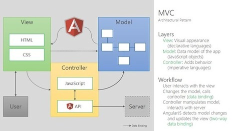


## AngularJS的关键特性

可测试性，依赖注入，逻辑/视图层的分离，还有设计者和开发者之间的协调合作是一个开发者对一个框架最期待的几样东西。Angular绝对满足上述要求。在JS领域，Angular能适配这写令人耳目一新的要求看起来是多么惊人。

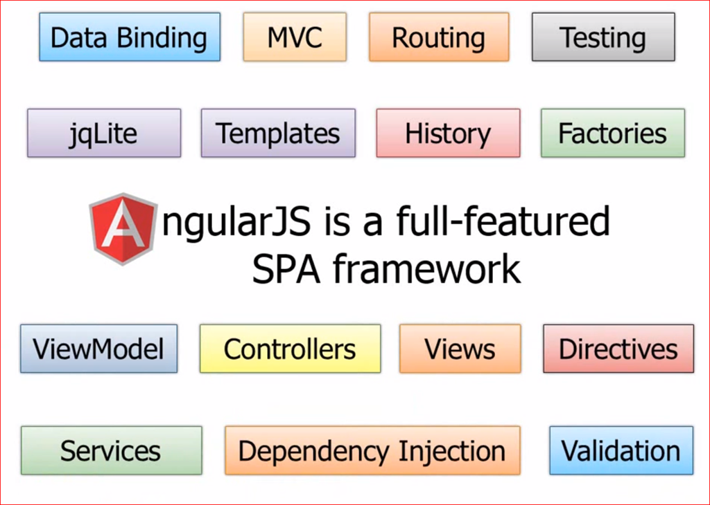

###  双向数据绑定:

数据绑定可能是AngularJS里最酷，最实用的功能。 它将节省你大量的样板代码编写。 一个典型的Web应用程序可以包含多达80％的代码基础，如遍历，操作，并听取了监听DOM。 数据绑定使得不用编写这些代码，这样你就可以专注于你的应用程序。

考虑下你的应用程序的模型为单源信任的。 你的模型就是你去读取或更新应用程序中的任何东西的地方。这种投射是无缝的，不需费你一兵一卒。AngularJS双向数据绑定会处理DOM和模型之间的同步，反之亦然。


### 模板

在AngularJS, 模板就是原生的HTML. 做了基于视图的增强. 这样做最大的好处在于拉近了开发与设计人员的工作流. 设计人员操作ＨＴＭＬ完成设计，开发直接在ＨＴＭＬ上作相应的功能开发。

```
<div ng-controller="AlbumCtrl">
  <ul>
    <li ng-repeat="image in images">
      
    </li>
  </ul>
</div>

```

### MVC

AngularJS引入了软件设计的ＭＶＣ模式.这对于使用者来说仁者见仁智者见智. AngularJS并不是完全的ＭＶＣ而是 MVVM (Model-View-ViewModel).

- 模型
model就是数据模型 就是一些JavaScript 对象. 没必要从父类继承，代理包装亦或是使用getter/setter来使用. 使用vanilla JavaScript 十分方便便捷.
- 视图
视图就是提供特殊数据或方法来支持特定场景的对象.
视图对象就是 $scope. $scope就是个简单的js对象，提供一些简单的ＡＰＩ监控其状态.
- 业务控制
控制器起到设置 $scope对象的初始状态及后续的动作关联。 
- 页面
在.AngularJS处理完相关的业务逻辑进行ＨＴＭＬ模式的展示。
这样就奠定了应用的架构.  $scope对象拥有数据的引用关系, 控制器定义行为, 视图处理页面展示布局以及相应的处理跳转.


### 依赖注入

AngularJS 提供了依赖注入的子系统帮助开发人员降低开发复杂度，提高测试效率.依赖注入将业务代码与配置实现解耦，提高了代码的可测性. 
有了ＤＩ无需每次都创建指定的对象依赖关系，而后面配置. 这样就能按需分配而无需自己制定或是查找. 就像要说一句"Hey I need X', ＤＩ就会帮你创建并发送给你.
采用依赖注入后能体验到的好处主要包括:
- 代码更易于维护。
- API更为简练和抽象。
- 代码更易于测试。
- 代码更加模块化、可复用性更强。

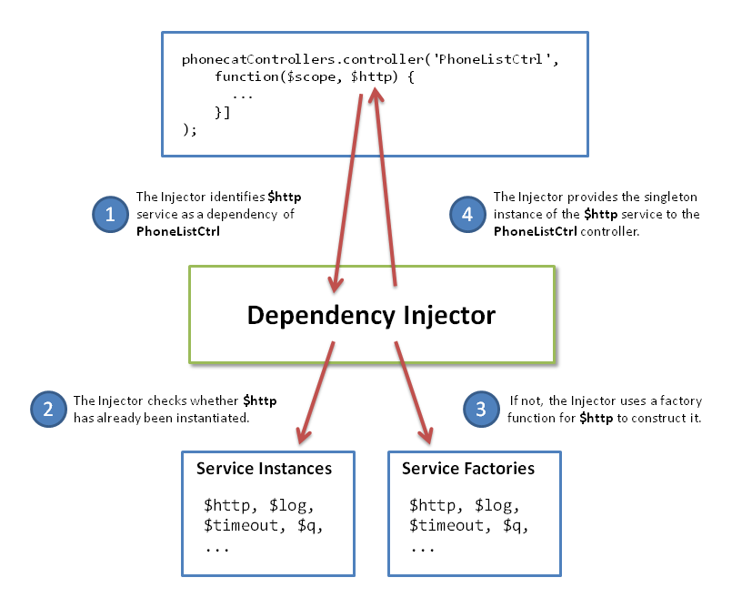

### 指令

指令可以被用来创建自定义的HTML标签，这些标签可以用作新的自定义的控件。它们也可以用来"渲染"有一定行为的元素，也可以以一些有趣的方式来操 作DOM属性。一个指令就是一个能引入新语法的东西。把分离的组件组合成一个组件，这种创建应用的方式将使得添加、修改和删除页面功能变得异常简单。指令 是AngularJS的一个非常强大且独有的特性。
从更高的层次说,  DOM 元素上的指令 (像是属性，元素名，注释或是 CSS ) 等给 AngularJS's HTML 编译器传递的数据($compile) 从而传递指定的功能到ＤＯＭ元素或是子元素。
Angular 有很多这样的内置指令，像是 ngBind, ngModel, 和ngView.Y还能自定义指令，当Angular启动后HTML编译器就会自动建立ＤＯＭ元素的指令映射.

### 测试
AngularJS 意识到凡是js写的代码需要加强测试. 这在 AngularJS 设计之初就有了, 于是Angular的可测试性不言而喻.
JS是解释性的动态语言，设计相应的测试决不可小觑.
AngularJS 完全基于可测的根基设计出来的. 它提供了端到端的单元测试. API文档就是详细的测试覆盖说明. 

## AngularJS Bootstrap Process

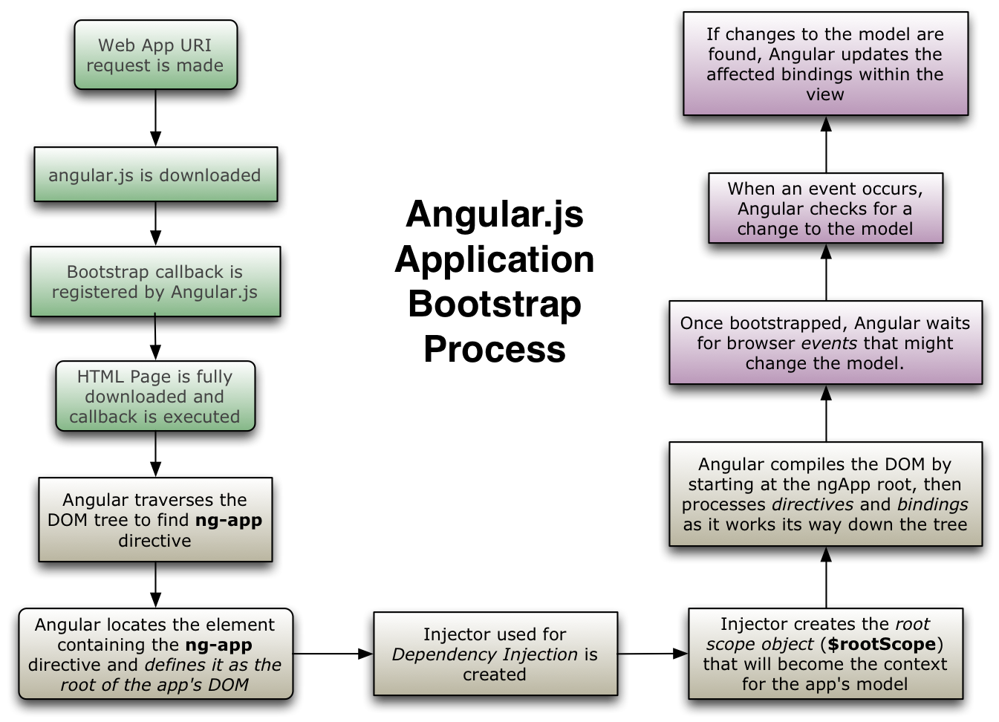

## 学习曲线

刚开始学Augular觉得开发应用需要有相当的编程基础. 不得不说这确实是一款了不起的开发框架，它要求开发人员设计低耦合和可维护的应用. 使用AngularJS 的复杂度就像使用PHP，Ruby on Rails等等, 都需要处理依赖注入，路由，值域等等. 这也不是什么新技术了. Angular只是发扬光大了.

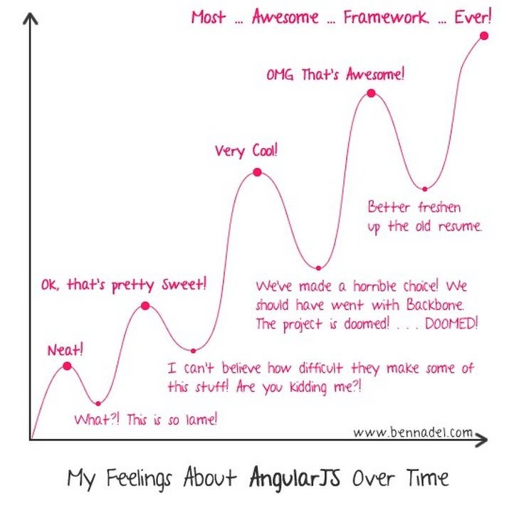

## JS MVC frameworks


MVC (模型-视图-控制器) 是一套设计模式，可以分层设计应用. 将数据(模型) 与用户视图 (视图)解耦, 通过中间控制器 (Controllers) 处理业务逻辑， 用户输入以及相应的逻辑跳转. 现代JS框架提供了简易的操作以及SoC (业务分离) 更好的实现了MVC .
MVC 对于JS有很多好处— 提高了高可靠性的代码. 已被很多语言大量测试验证过，具有高可靠性.
MVC 实现的三层结构:

1. 模型: 是应用程序中用于处理应用程序数据逻辑的部分。通常模型对象负责在数据库中存取数据.
2. 视图: 是应用程序中处理数据显示的部分。通常视图是依据模型数据创建的.
3. 控制: 是应用程序中处理用户交互的部分。通常控制器负责从视图读取数据，控制用户输入，并向模型发送数据.


JavaScript ‘MVC’可以帮助构建我们的代码，但尽信书不如无书. 有些框架把控制器放在视图模式(比如 Backbone.js) 有些框架全部混在一起使用. 除此外还有其他的MVC模式，像是 MVP (Model-View-Presenter) and MVVM (Model-View ViewModel). 即便是MVC设计模型, 不同的语言也有不同的实现方式. 像是, 有些MVC实现会有自己的视图变更控制器亦或是控制器视图. 这些框架被称为 MV* 框架, 意味着你会有模型，视图但更会有其他的部分. 
很长一段时间 AngularJS 是很标准的 MVC (或者说在客户端实现这一块),但在后来一段时间内随着代码重构和API的重写，现在更是 MVVM模式了 –  $scope 对象被认为是视图模型然后被称为控制器的功能模块包装. 这样分配到MV模式中是有些好处的.它会帮助开发者使用简易的API开发基于框架的代码. 也能统一开发的共识。 使用MVC的初衷就是分解结构, 然后通过设置参数决定具体使用哪种 MV* 框架, Igor Minar (核心 AngularJS团队)宣称AngularJS 是 MVW 框架- Model-View-Whatever. whatever就是定制化的需求.

## 为什么使用 JS MVC 框架

再来看看使用MVC和传统开发模式的区别
传统Web应用


传统模式处理业务请求全部放在服务端，前段只是页面交互 (瘦客户端, 胖服务端). 这会有以下问题:
- 分布式处理能力弱 – 服务器处理大量业务，性能堪忧.
- 相应压力 – 传统应用的响应速度是个硬伤.
- 开发复杂度 –C/S结构的应用开发是比较复杂的. 由于每次请求响应都涉及到交互设计，很容易出错。未解决该问题的框架也是层出不穷，可惜易用性有待考究.
- 被攻击危险 – 混编业务代码和交互代码，增加了代码受攻击的概率.在复杂度很高的应用中更是不容易控制安全性。
- 服务端的负载过大 – 所有客户端的请求都需要经由服务端处理，这意味着所有的session都要等待30分钟后才能被释放，这时客户请求早已处理完毕，但还在占用系统资源，大大降低了系统性能和伸缩性.
- 离线处理 – 拥有离线处理能力是web应用的竞争力，尤其在处理大量客户端请求的应用中，离线处理部分业务更是不可或缺.
- 互操作性弱– 由于混杂编写，代码逻辑很难分割，扩展功能变得复杂.

JSMVC Web 应用程序


JS MVC web应用程序架构主要致力于将服务端的逻辑处理转移到客户端和实现瘦客户端web应用程序。client/server模型的处理逻辑和代码被委托给浏览器的好处是：
- 可扩展性：很容易看到利用客户端处理在可扩展性方面的优势。服务器处理能力保持不变的前提下，应用被越多的客户使用，那么越多的客户端机器可以被使用（直到你购买更多的服务器）。
- 实时的用户响应：客户端代码可以立即对用户的输入作出反应，而不需要等待网络传输。
- 结构清晰的编程模型：用户界面可以有效地分离应用程序的业务逻辑。这样的模型为安全提供了一个更加简洁方法。所有通过用户界面的发出的请求，我们可以在数 据通过各种接口前进行安全检查。使用复杂的分析流程会让安全分析变得更加复杂。另一方面，用清晰的web服务接口，有明确的网关安全工作和安全分析更简单 直观，漏洞可以快速发现并纠正。
- 客户端状态管理：在客户端维护临时会话状态信息可以减少服务器上的内存负载。这也允许客户利用更多的RESTful交互，可以进一步提高可伸缩性和使用缓存的时机。
- 离线应用-如果大部分应用程序的代码已经在客户端上运行，那么创建一个离线版本的应用程序可以肯定将会变得更加容易。
- 互操作性：通过使用结构化数据和最小限度的api进行交互，这样更容易连接额外的消费者和生产者与现有系统进行交互。

为了开发实现一个客户端web应用程序，需要组织我们的项目结构，这样更易于后期的管理和维护。一个应用程序的脚本超过几十行的时候，如果它的组件之 间的功能没有分开处理，这样应用会变得越来越难管理。我们一开始开发一个web应用程序的时候，可能会觉得简单地通过一个DOM操作库（如jQuery） 和一些实用的插件就可以完成了。这样我们很容易就被应用里面jQuery的嵌套回调函数和没有任何组织结构的DOM元素给搞蒙了。为了避免前面说到的问 题，我们采用spaghetti code （一个描叙代码的术语，用来形容代码难以阅读和因为缺乏组织结构难以维护）。像使用jQuery这样的DOM操作库和一些其他的实用库我们可以 更加容易使构建一个网页。但是，这些库在我们构建web应用程序时失去作用。
web应用程序不像一个普通的网页，他们更倾向于与用户的交互并且需要实时与后端服务器通信。如果你没有使用MVC框架来处理，这样会最终会让你写出 一些编写混乱、非结构化、不可维护、不可测试的代码。为了避免“spaghetti”式的代码，那么JavaScript开发人员必须首先要了解这种模式 提供了什么东西。这就可以看到这些框架能够让我们做什么哪些不同的事情。
使用JavaScript构建一个单页面应用程序的时候，不管是否拥有一个复杂的用户界面或者只是为了减少HTTP请求的数量，你可能会发现自己写的 很多可以组成一个MV *框架的代码。刚开始的时候，使用自己想出来的方式来避免“spaghetti”式代码写一个应用框架并不是一件很难的事情，但是写出像 Angular/Backbone这样的代码水平那就不太可能了。
我们会发现有更多的人会倾向于构建一个应用，而不是试着去将DOM操作库、模板、路由结合到一起。成熟的MV *框架通常不仅包括很多你发现自己写过的类似的功能代码，而且也包含了很多你曾经遇到并且已经解决了的问题。框架为你节省了很多时间，这就是框架不能低估 的价值所在。
现在的浏览器提供了丰富的功能，变得越来越强大，这不仅让在JavaScript中构建成熟的web应用程序成为可能，而且这个方式越来越受欢迎。根据 HTTP Archive数据显示，今年部署的JavaScript代码规模增长了45%。

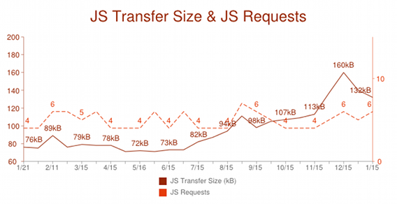

随着JavaScript的人气攀升， 我们的客户端应用程序比以前复杂得多 。一个应用程序开发需要多个开发人员合作，所以编写可维护和可重用代码在新的web应用程序时代是非常重要的。设计模式对于编写可维护和可重用的代码是很 重要的。在过去几年时间里面，有很多JavaScript MVC框架已经被设计开发出来了，比如AngularJS，backbone.js， ember.js，还有很多其他的框架。虽然他们都有其独特的优势，但是每一框架都会鼓励开发人员遵循一定的形式以编写出更加结构化的 JavaScript代码。

## 什么时候需要使用一个JS MV*框架

如果你在构建一个应用，它的客户端有许多重量级的功能，用纯JavaScript很难应付，那你就应该考虑使用一个MVC框架。 如果选择错误，你将会错过MVC框架提供的功能，陷入重新发明轮子的境地。
要注意的是，如果你构建的应用在服务器端有很多重量级功能(即视图生成/展现逻辑)并且在客户端没有多少交互的话，这时你会发现使用MVC框架就像是杀鸡用牛刀。在那种情况下更好的选择是，使用一个更简单的、有少量附加功能的DOM操控类库。
下面这个列表并不完备，但是我们希望它能提供充分的理由帮你决定是否在你的应用中应该使用一个MVC框架:
- 你的应用需要异步连接到后台
- 你的应用有这样的功能，它不需要重新载入整个页面(比如给博文增加一条评论，无下限滚动)
- 多数视图或者数据操作将会在浏览器内完成，而不是在服务器端完成
- 同样的数据在页面上需要进行不同方式的渲染
- 你的应用有许多琐碎的交互来修改数据(按钮, 开关)

满足这些情况的比较好的web应用的例子有Google Docs，Gmail或者Spotify。

## 客户机/服务器架构的web应用程序

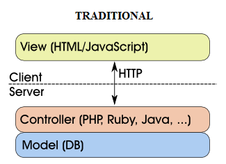

客户端一侧的MVC可以处理整个MVC栈。如果你同时使用服务器和客户端MVC，那么你会复制你的模型和路径。客户端一侧的MVC基本上允许你将你的 服务器和客户端连接起来。为什么你的服务器要发送视图层？为什么不发送以json为格式的模型并加载它到客户端一侧，让客户端去渲染视图。你甚至可以在将 来为其规定路由。为什么服务器要处理路由？客户端可以做这个。仅仅允许客户端去访问你的RESTful数据库就行，并且你不需要任何服务器端的MVC。
较流行的一种包含客户端服务端的模式是 后端RESTful API 通过 JSON发送数据模型 客户端使用MVC模式 处理应用.

## Client-side MVC with server-side RESTful API


## Data Flow


## AngularJS和其他JS MVC框架的对比

在与其他JS MVC框架的争战中，AngularJS已经胜利了。它已经证明了自己是所有JS MVC框架中最成熟的。下面是来论证的数据
社区支持


（数据来自Github.com）


（数据来自StackOverflow.com）随着时间推移，兴趣的趋势

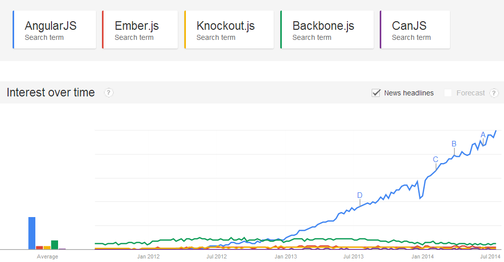

（2011年8月-2014年6月）


（上一年）使用统计

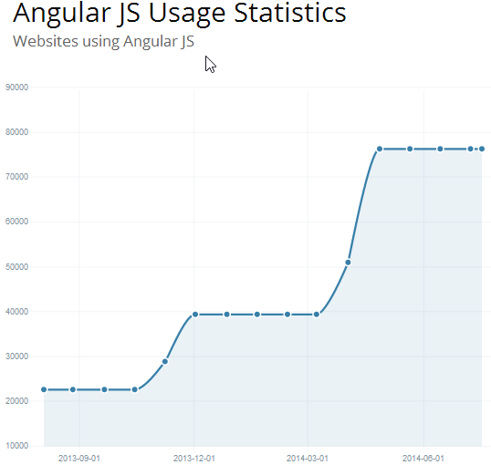

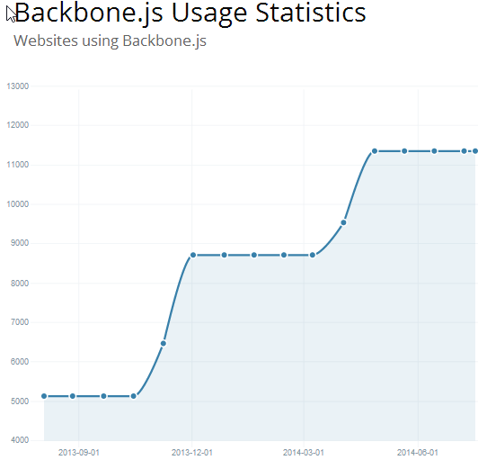


特性对比

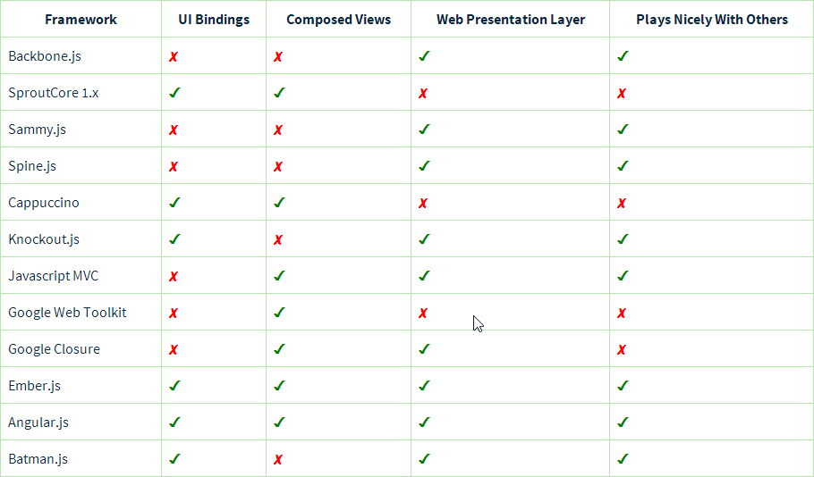


用户入门


工作趋势

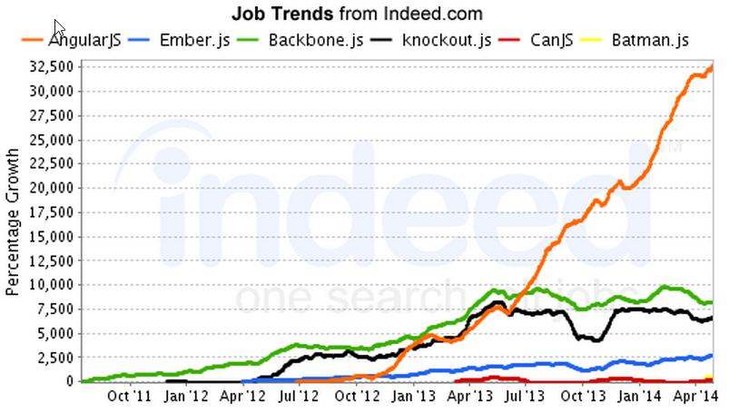

## 对比Angularjs和类似Dojo的企业级工具集(Toolkit)

Dojo Toolkit:

Dojo Toolkit是一个致力于简化跨平台JavaScript/Ajax应用和网站的开源模块化JavaScript类库. Dojo是一个面向大规模客户端web开发的JavaScript框架. 例如, Dojo抽取出一个屏蔽各种浏览器差异的API集合. 此外, Dojo的功能还包含: 定义了模块化代码的框架, 并管理他们的相互依赖关系;  提供构建工具集, 可以用来优化JavaScript和CSS代码, 生成文档并且运行单测; 支持国际化, 本地化和无障碍(accessibility); 提供了丰富了通用工具类和用户界面组件(Widget).

- 社区支持

|  | AngularJS | DOJO |
|-----|-----|-----|
| 关注/收藏数|25760|300|
| Fork次数 |9136|216|
|贡献者|877|59|
|发布次数|92|147|

- MVC

Angular开发团队已经将MVC设计模式以多种方式引入到Angular中, 因此会使得开发也必须跟随这MVC设计模式. AngularJS并没有以传统的方式实现MVC, 而是更接近于MVVM(Model-View-ViewModel), 因此有时被统称为MV*. MVC是Angular的核心, Angular为MVC设计模式提供了原生的支持, 可以轻易将其应用于web应用程序的开发中.
Dojo的Toolkit为JS应用程序提供了实现MVC的独立工具包. Dojo并没有为JS应用程序提供完备的MVC实现, 而是根据应用程序自身需要, 选择性使用其中的MVC工具/组件. Dojo提供MVC功能的包是dojox/mvc.这个dojox/mvc包主要关注客户端的View到Model的数据绑定, 仅提供了在一个View中的数据绑定/控制器的支持, 并未提供在应用程序级别的跨多个View的支持(例如, 导航(Navigation)的支持). 
在Dojo中，MVC应用中的级别关注点比如路由或者导航等必须使用另一个包(dojox/app)来处理，而在AngularJS框架中，这些关注点都是框架自身就能处理的。
dojox/mvc模块的状态现在仍然是“Experimental” ，所以它仍然是不稳定的，正如下面这篇文章所说的(http: //dojotoolkit.org/reference-guide/1.10/dojox/index.html#dojox-index)，而 Angular则是一个经过了更多的验证、稳定而成熟的JS MVC框架。
- SPA 

AngularJS是一个流行的全功能的SPA框架。AngularJS的一些固有特性支持了单页面应用的开发。Angular通过下列特性来支持SPA:
- 内嵌视图(Nested Views)
- 控制器(Controller)继承
- 路由(Routing)

Dojo通过其Dojox/app包实现其构建单页应用的目标。这个包是个小型的应用框架，提供了一组类，用于管理部署在移动设备或桌面系统上的单页面应用的生命周期和行为。该应用框架被设计成只需简单配置一个配置文件，由潜在的嵌套视图组成应用，并便于这些视图之间的过渡。
使用Angular开发单页面应用，可以很好的集成整个框架，同时框架提供了MVC功能，例如路由，控制器，视图和单页面应用模式是紧密结合的。Dojo中的Dojox/app则是一个独立的组件，并未将单页面应用与MVC紧密结合，因此，Dojox/mvc在使用的时候必须通过配置Dojox/app来管理解决，而这在Angular中是自带的，而且容易使用的。
- UI 挂件和库

Dojo提供了底层系统所支持的大量的widget(用户接口组件).Dojo的UI库称为Dijit,使用一个单独的命名空间"dijit".
Angular确实提供了一个UI widget工具集,但是没有Dojo所提供的广泛.Angular允许随意使用流行的第三方UI库.它提供了名为"Angular-UI"的UI库,这个库包含各种流行的第三方库的widget和模块.其中,UI-Bootstrap模块将Bootstrcp框架的所有widget作为Angular指令.
由于Dojo是一个工具集,所以它的

AngularJS使用angular-resource(ngResource)模块来提供RESTful交互功能，该模块表示一个REST资源并提供帮助方法(GET/POST/PUT/DELETE)来轻松的实现RESTful交互。另外也提供其它的可选模块。
Dojo使用dojo/store/JsonRest来提供RESTful交互能力。它是一个轻量级的对象存储实现，给那些具有RESTful数据交互能力的HTTP客户端来使用。
AngularJS和Dojo都提供了大体相当的RESTful交互能力。
- 可维护性

AngularJS提供了一些特性,让拥有大量代码基数的应用程序变得可维护.这些特性如下:
- AngularJS 鼓励和增强最小化DOM操作,推荐只在HTML中使用的指令中展现DOM操作.这样可以避免由于大量使用DOM和DOM事件等产生的"意大利面"式的代码.这些代码在大的web应用程序中难于调试和跟踪.Angular指令也为增加了HTML语义.
- Angular提供了一些类似模块的特性,它允许应用程序开发者,将不同部分的应用程序逻辑打包成模块,以增加应用程序的模块化和可维护性.
- Angular提供了DI (依赖注入) 设计模式的固有特性,它帮助应用程序保持模块化和易读性.
- 项目结构框架对于AngularJS已经可用,可以用来开发可维护的企业web应用程序.

Dojo没有提供最小化DOM操作的技术,这样,对于大型web应用程序,DOM操作增加了趋向于“意大利面”式代码的可能性,也影响了应用程序的可维护性. Dojo支持模块(AMD),但是没有为web应用程序提供DI模式.

- 数据绑定和视图模板化

商业web应用程序的数据中心原则要求来自模型的数据和UI同步更新.对于一个商业web应用程序,动态视图必须依赖于模型数据而创建.Angular提供了相当简单和已有的技术,声明式的编写绑定到模块数据的动态视图.在Angular里面,视图模板化使用包含Augular专有的元素和属性的HTML编写.使用HTML作为模板化语言,对于开发者而言,更易于创建和理解视图.Angular结合了来自模型和控制器的信息模板,用来渲染用户在浏览器中看到的动态视图.Angular使用了双向绑定特性以保持UI和模型的同步.

同样的特性也可以在Dojo中使用,但是,它们和Dojo工具集的流程不太协调,也缺少了这个特性的简单和细微化.

- 声明式的用户接口
AngularJS 提升了HTML视图的 声明式设计（declarative design）。在视图层，使用HTML作为模板语言让它变得相当容易开发创建视图，同时也变得易于理解，在视图语义上也有利于其他开发者。Angular提供一个特性，被称为“directives”，它可以根据领域的需要，来提高HTML的定制性。 
声明式设计（declarative design）可以在Dojo应用中通过使用data-*属性运行，但是它跟Angular的“directives”特性不一样。

- 支持 AngularJS 能更好的进行 IDE 和浏览器调试

Netbeans IDE也为AngularJS提供了内嵌的支持,它让使用AngularJS可以简单的开发web应用程序.(http://wiki.netbeans.org/NetBeans_80_NewAndNoteworthy#JavaScript)
Angular团队也为Google Chrome浏览器创建了一个名为Batarang的插件,它提高了使用Angular开发应用程序的调试体验.这个插件旨在简化性能瓶颈的检测,以及提供GUI来调试应用程序.

- 使用Dojo的时候很难在大型团队中保持代码的统一

Dojo中的编程模型是使用widget,当拓展它们的时候,它们将你的代码包围住.你仍然在编程来操作DOM,连接/注册/取消注册事件.Dojox/mvc并没有生成模块化的代码.在Dojo中有多余2种或3种的方式做同样的事情.其中一些甚至是糟糕的实践,但是并没有被清除.很难在大型团队中加强代码的统一,因为Dojo没有为模块化和统一化的web应用程序提供整体的框架.
AngularJS提供了一个全面的框架，包含MVC的核心及规划模型，具有均匀性，可理解性和模块化。AngularJS只为模型提供嵌套的控制器。良好的测试应用程序隔离的部分。定义良好的相关性。大部分时间你不写代码操纵DOM自身。但你可以在创建指令（组件）时这样做。没有命名空间混乱。你的对象从来不会出现在全局命名空间中，好像一切都封装在Angular的应用中。MVC模式是核心。你的应用程序是一套控制器，服务，过滤器和自定义指令。

原文地址：http://www.codeproject.com/Articles/799241/AngularJS-The-next-BIG-thing


## 总结

本文意图让我们知晓web应用的未来就在眼前。并尝试概述一个正确的有指导意义的方法来结构化和设计一个web应用，使之能适应web世界。本文概述了客户端JS MV*框架的使用，并说明了为什么用客户端MVC框架组织的web应用很适合实现web应用。
本文集中分析和总结了在成熟的客户端MVC框架下的对比，并提供一些对比的统计信息，帮助你和你的团队决策，选择出适合你的web应用的客户端MVC框架。
本文偏向于AngularJS框架，你可以有不同的偏好。对我来说AngularJS是我个人的喜好所在，在我眼中是其他客户端MVC框架所不能匹敌的。

# 网仓三号前端开发部署教程

## 概述

开发环境:
* [NodeJS](http://nodejs.org/) (with [NPM](https://www.npmjs.org/)):开发工具运行环境
* [Bower](http://bower.io)：twitter 推出的一款包管理工具，基于nodejs的模块化思想，把功能分散到各个模块中，让模块和模块之间存在联系，通过 Bower 来管理模块间的这种联系。
* [Gulp](http://gulpjs.com)：
基于Nodejs的自动任务运行器， 她能自动化地完成 javascript/coffee/sass/less/html/image/css 等文件的的测试、检查、合并、压缩、格式化、浏览器自动刷新、部署文件生成，并监听文件在改动后重复指定的这些步骤。在实现上，她借鉴了Unix操作系统的管道（pipe）思想，前一级的输出，直接变成后一级的输入，使得在操作上非常简单。通过本文，我们将学习如何使用Gulp来改变开发流程，从而使开发更加快速高效。
* [Git](https://git-scm.com/download/):一款免费、开源的分布式版本控制系统，用于敏捷高效地处理任何或小或大的项目

## 安装

1. 首先需要安装NodeJS,到官网https://nodejs.org/en/ 下载安装即可
2. Gulp: 
```
npm install gulp -g
```
3. Bower: 
```
npm install bower -g
```
4. 安装Git
5. 下载项目源代码:git clone http://192.168.6.115:7990/scm/dev/web.git
6. 安装node依赖包: 
```
npm install 
```
7. 安装bower依赖包: 
```
bower install
```
8. 使用Gulp进行构建：
```
gulp
```
9. 访问:http://127.0.0.1:8080

## 开发

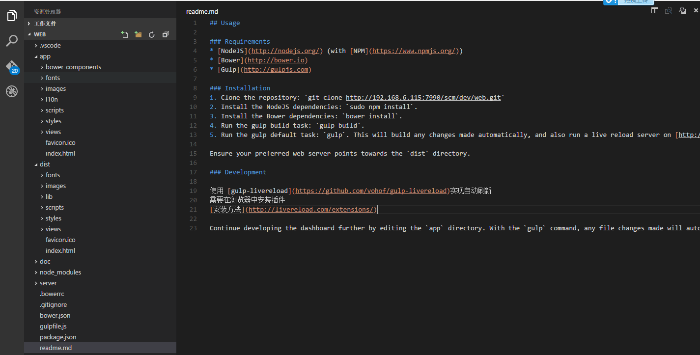

项目结构说明

**app:项目源码**

- bower-components:bower资源包文件
- fonts:字体文件
- images:图片文件
- i10N:国际化文件
- scripts:js脚本文件
- styles:css样式文件
- views:angularjs模块化开发主目录
- index.html:入口文件

**dist:使用Gulp根据项目源码构建生成的，生产环境部署时使用该目录**

**doc:项目说明文档**

**node_modules:nodejs模块依赖文件夹,执行npm install 时都会安装到该文件夹**

**server:后端模拟数据**

## 跨域

### 什么是跨域

跨域，指的是浏览器不能执行其他网站的脚本。它是由浏览器的同源策略造成的，是浏览器对javascript施加的安全限制。

所谓同源是指，域名，协议，端口相同。浏览器执行javascript脚本时，会检查这个脚本属于那个页面，如果不是同源页面，就不会被执行。

同源策略的目的，是防止黑客做一些做奸犯科的勾当。比如说，如果一个银行的一个应用允许用户上传网页，如果没有同源策略，黑客可以编写一个登陆表单提交到自己的服务器上，得到一个看上去相当高大上的页面。黑客把这个页面通过邮件等发给用户，用户误认为这是某银行的主网页进行登陆，就会泄露自己的用户数据。而因为浏览器的同源策略，黑客无法收到表单数据。

现在随着RESTFUL的流行，很多应用提供http/https接口的API，通过xml/json格式对外提供服务，实现开放架构。如，微博、微信、天气预报、openstack等网站和应用都提供restful接口。

Web应用也在向单页面方向发展。

越来越多的web应用现在是这样的架构：

静态单个web页面

ajax调用

RESTFUL服务

我们本可以利用各个网站提供的API，做出很多精彩的Web应用。但浏览器执行javascript时的跨域限制，就成为了这类开放架构的拦路虎。

本文提出了一种简单有效的方式解决跨域问题。

### 常用的跨域方法
常用的跨域方法有这样一些：

- 使用iFrame访问另一个域。 然后再从另一个页面读取iFrame的内容。jquery等有一些封装。
据说Firefox等可能不支持读取另一个iFrame的内容。
- jsonp。需要服务器支持。使用script src动态得到一段java代码。是回调页面上的js函数，参数是一个json对象。
jquery也有封装。
- 设置http头，Access-Control-Allow-Origin：*
但据说IE有一些版本不识别这个http头。

- 服务器代理。如，服务器写一个url的处理action。其参数是一个url。这个服务器会用参数拼凑一个url,用httpclient库去执行url，然后把读取的内容再输出到http客户端。

### nginx反向代理实现跨域

禁止跨域问题其实是浏览器的一种安全行为，而现在的大多数解决方案都是用标签可以跨域访问的这个漏洞或者是技巧去完成，但都少不了目标服务器做相应的改变，而我最近遇到了一个需求是，目标服务器不能给予我一个header，更不可以改变代码返回个script，所以前5种方案都被我否决掉。最后因为我的网站是我自己的主机，所以我决定搭建一个nginx并把相应代码部署在它的下面，由页面请求本域名的一个地址，转由nginx代理处理后返回结果给页面，而且这一切都是同步的。

首先找到nginx.conf或者nginx.conf.default 或者是default里面的这部份

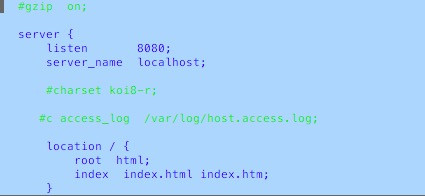

其中server代表启动的一个服务，location 是一个定位规则。

```
location /｛   #所有以/开头的地址，实际上是所有请求

root  html     ＃去请求../html文件夹里的文件,其中..的路径在nginx里面有定义，安装的时候会有默认路径，详见另一篇博客

index  index.html index.htm  ＃首页响应地址

｝
```

从上面可以看出location是nginx用来路由的入口，所以我们接下来要在location里面完成我们的反向代理。

假如我们我们是www.a.com/html/msg.html 想请求www.b.com/api/?method=1&para=2；

我们的ajax：

```
var url = 'http://www.b.com/api/msg?method=1¶=2'；

$.ajax({
type: "GET",
url:url,
success: function(res){..},
....
})
```

上面的请求必然会遇到跨域问题，这时我们需要修改一下我们的请求url，让请求发在nginx的一个url下。

```
var url = 'http://www.b.com/api/msg?method=1¶=2'； 
var proxyurl ＝ 'msg?method=1¶=2'；
//假如实际地址是 www.a.com/proxy/html/api/msg?method=1¶=2; www.a.com是nginx主机地址
 $.ajax({ 
type: "GET", 
url:proxyurl, 
success: function(res){..}, 
.... 
})　　
```

再在刚才的路径中匹配到这个请求，我们在location下面再添加一个location。

```
location ^~/proxy/html/{
rewrite ^/proxy/html/(.*)$ /$1 break;
proxy_pass http://www.b.com/;
}
```

以下做一个解释：

- '^~ /api/ '

就像上面说的一样是一个匹配规则，用于拦截请求，匹配任何以 /api/ 开头的地址，匹配符合以后，停止往下搜索正则。
- rewrite ^/proxy/html/(.*)$ /$1 break;
代表重写拦截进来的请求，并且只能对域名后边的除去传递的参数外的字符串起作用，例如www.c.com/proxy/html/api/msg?method=1&para=2重写。只对/proxy/html/api/msg重写。

rewrite后面的参数是一个简单的正则 ^/proxy/html/(.*)$ ,$1代表正则中的第一个(),$2代表第二个()的值,以此类推。

break代表匹配一个之后停止匹配。

- proxy_pass

 既是把请求代理到其他主机，其中 http://www.b.com/ 写法和  http://www.b.com写法的区别如下:

不带/

```
location /html/
{
　　proxy_pass http://b.com:8300;  
}
```

带/

```
location /html/  
{  
    proxy_pass http://b.com:8300/;  
}
```

上面两种配置，区别只在于proxy_pass转发的路径后是否带 “/”。

针对情况1，如果访问url = http://server/html/test.jsp，则被nginx代理后，请求路径会便问http://proxy_pass/html/test.jsp，将test/ 作为根路径，请求test/路径下的资源。

针对情况2，如果访问url = http://server/html/test.jsp，则被nginx代理后，请求路径会变为 http://proxy_pass/test.jsp，直接访问server的根资源。

修改配置后重启nginx代理就成功了

### 总结

本文介绍了利用nginx的反向代理的功能，实现跨域访问任意应用和网站的方法。

nginx是一个高性能的web服务器，常用作反向代理服务器。nginx作为反向代理服务器，就是把http请求转发到另一个或者一些服务器上。

通过把本地一个url前缀映射到要跨域访问的web服务器上，就可以实现跨域访问。

对于浏览器来说，访问的就是同源服务器上的一个url。而nginx通过检测url前缀，把http请求转发到后面真实的物理服务器。并通过rewrite命令把前缀再去掉。这样真实的服务器就可以正确处理请求，并且并不知道这个请求是来自代理服务器的。

简单说，nginx服务器欺骗了浏览器，让它认为这是同源调用，从而解决了浏览器的跨域问题。又通过重写url，欺骗了真实的服务器，让它以为这个http请求是直接来自与用户浏览器的。

这样，为了解决跨域问题，只需要动一下nginx配置文件即可。简单、强大、高效!

参考：

用Nginx和Apache的反向代理解决Ajax的跨域问题

http://www.cnblogs.com/android-html5/archive/2010/07/08/2533806.html

最简单实现跨域的方法：使用nginx反向代理

http://blog.jobbole.com/90975/

#  前端资源教程

[angularjs入门ppt](angularjs入门.ppt)

http://cnodejs.org/topic/56ef3edd532839c33a99d00e

慕课网视频教程:http://www.imooc.com/course/list?c=angularjs